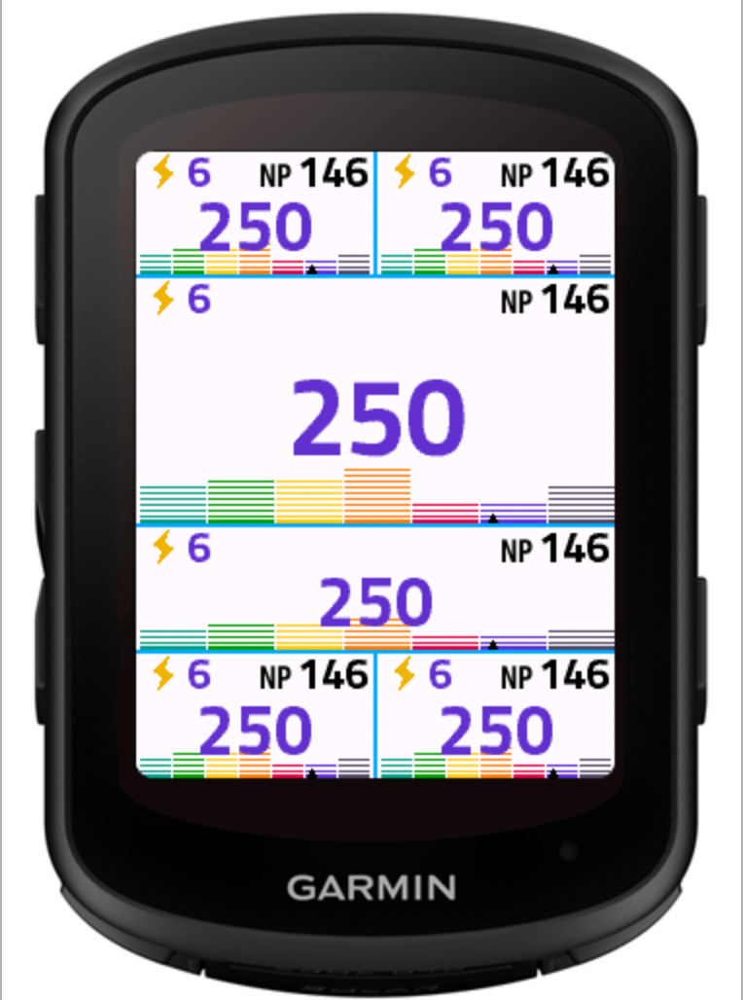
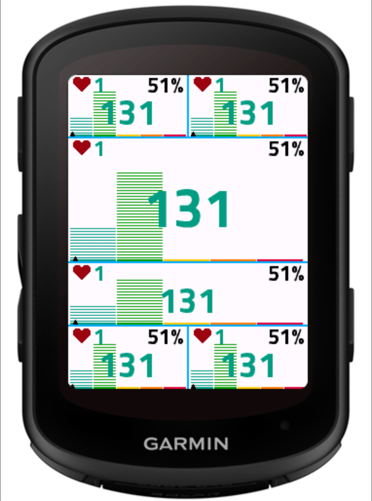
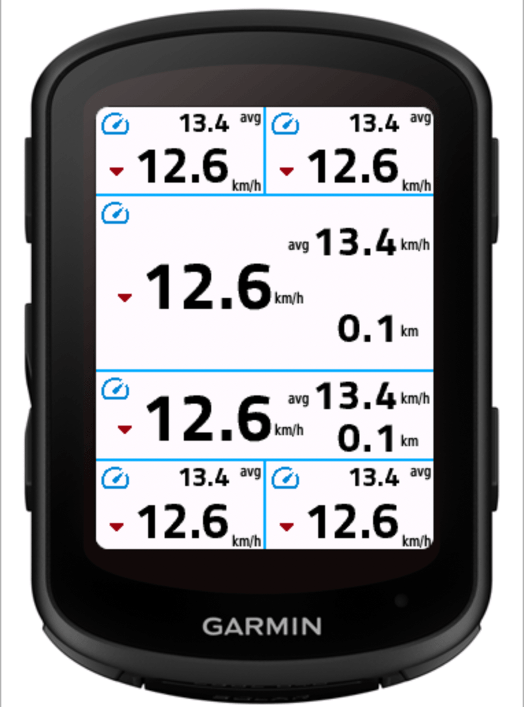
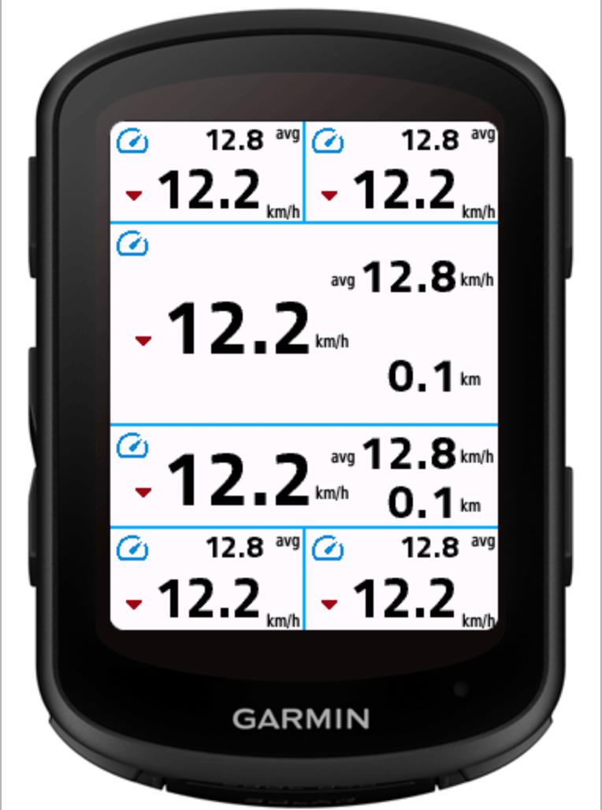
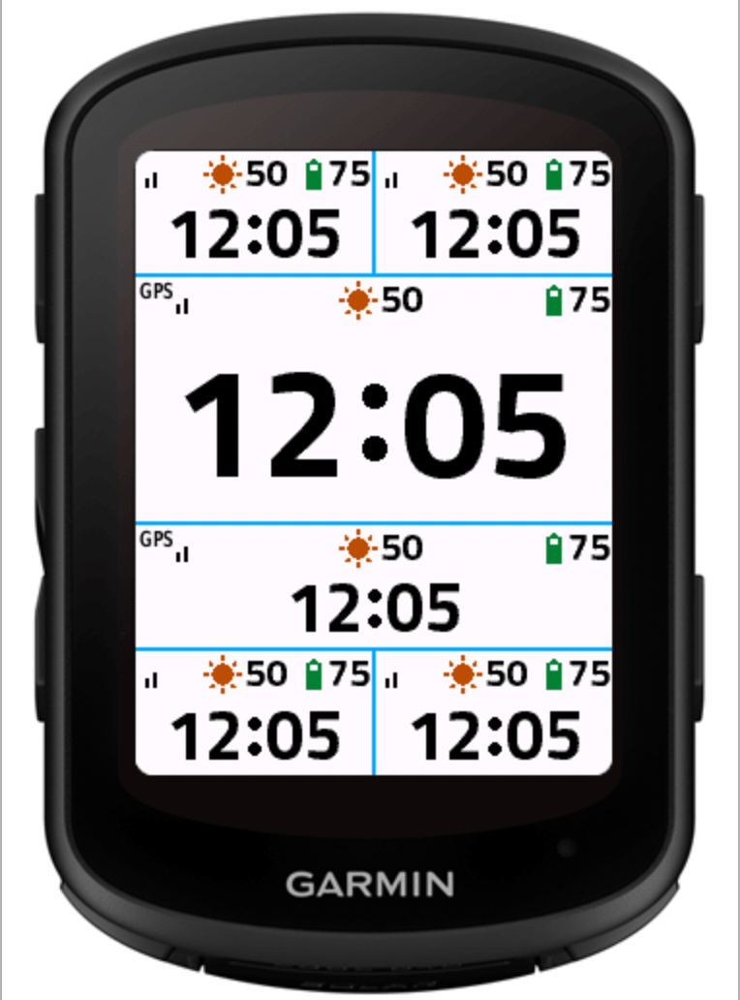
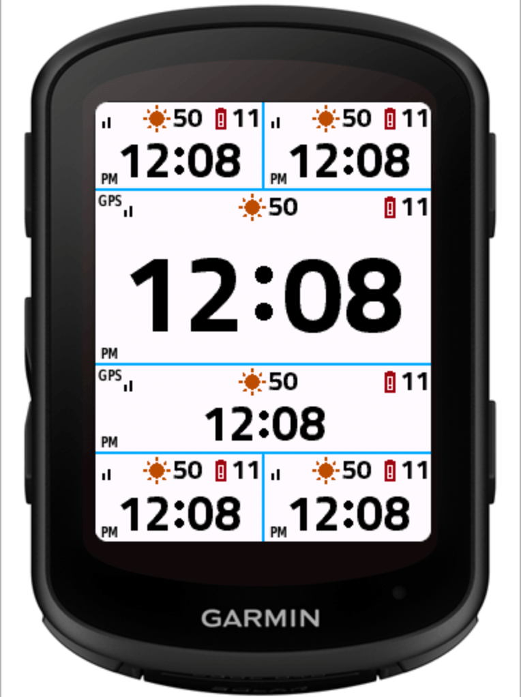

# FoxCIQ

FoxCIQ is a collection of Garmin Connect IQ data fields for Garmin Edge Cycle Computers.

Built with performance and privacy in mind, highly efficient code w/ minimum memory usage and heavily optimized for battery life, no outgoing network requests/connections at all.

Entirely open source under GPL-3.0 License on GitHub and free to use. Feel free to audit and contribute!

If you like my work, please consider supporting me on [GitHub Sponsors](https://github.com/sponsors/SukkaW).

## FoxPower

Real-time cycling power data field with 3-second smoothed power, Normalized Power (NP), zone indicator, and zone time histogram.

This data field uses the latest Garmin Connect IQ SDK and API, and we can fetch your FTP directly from your Garmin User Profile. Thus, we do not provide manual input for FTP. You must update your FTP in Garmin Connect instead.

Supports Garmin 5-zone and Friel/Coggan 7-zone systems (configurable via settings).

<table>
<tr>
<td width="50%"></td>
<td width="50%"></td>
</tr>
</table>

## FoxHeart

Heart rate data field with 3-second-smoothed HR, %MaxHR, zone indicator, and zone-time histogram.

This data field can fetch your Max HR and HRR directly from your Garmin User Profile. Due to Garmin Connect IQ SDK and API limitations, LTHR cannot be fetched directly from the Garmin User Profile.

Supports Garmin 5-zone and Friel 7-zone systems (configurable via settings). Friel zones can be calculated from LTHR (requires manual input of LTHR), Max HR (can either be read from Garmin User Profile automatically or be set manually), or Heart Rate Reserve (HRR; both Max HR and Resting HR can be read from Garmin User Profile automatically or set manually).

<table>
<tr>
<td width="50%"></td>
<td width="50%"></td>
</tr>
</table>

## FoxSpeed

Speed and distance data field with current speed, average speed, distance (only on wider layout), and speed trend indicator.

|                                 |                                 |
| :-----------------------------: | :-----------------------------: |
|  |  |

## FoxTime

Clock, GPS signal status, and battery data field, with optional solar intensity.

|                                |                                |
| :----------------------------: | :----------------------------: |
|  |  |

## Device Compatibility

All four data fields target the Connect IQ API 6.0.0+.

Supported devices:

- Garmin Edge 540 / 540 Solar

Currently the data fields are only tested on the Garmin Edge 540 / 540 Solar. Other devices (like 840 with the same screen dimention) may work, but have not been tested.

## License

[GPL-3.0](LICENSE)

----

**FoxCIQ** © [Sukka](https://github.com/SukkaW), Released under the [GPL-3.0](./LICENSE) License.
Authored and maintained by Sukka with help from contributors ([list](https://github.com/SukkaW/FoxCIQ/graphs/contributors)).

> [Personal Website](https://skk.moe) · [Blog](https://blog.skk.moe) · GitHub [@SukkaW](https://github.com/SukkaW) · Telegram Channel [@SukkaChannel](https://t.me/SukkaChannel) · Mastodon [@sukka@acg.mn](https://acg.mn/@sukka) · Twitter [@isukkaw](https://twitter.com/isukkaw) · BlueSky [@skk.moe](https://bsky.app/profile/skk.moe)

  

